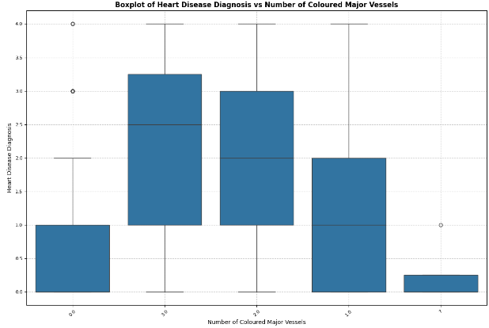
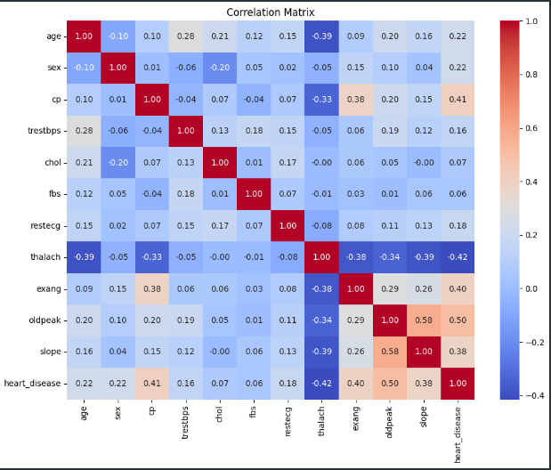
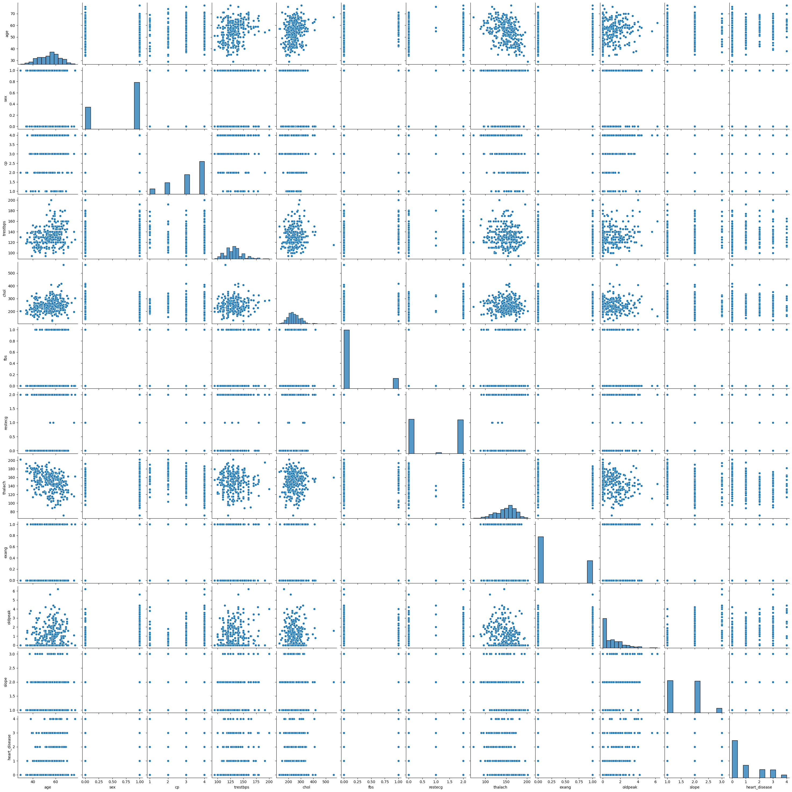
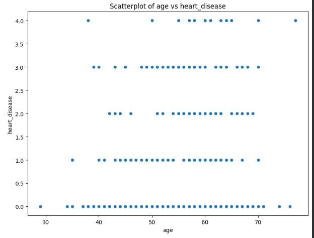

# Health Exploratory Data Analysis (EDA)

## Description

This project performs Exploratory Data Analysis (EDA) on a heart health dataset to uncover insights and patterns related to heart disease. The analysis includes data cleaning, univariate, bivariate, and multivariate analyses, along with visualizations to support findings.

## Installation Instructions

To set up the environment, please ensure you have Python installed along with the necessary libraries. You can create a virtual environment and install the required packages using:

```bash
pip install -r requirements.txt
```

## Usage

To run the analysis, open the Jupyter Notebook `Health_EDA.ipynb` and execute the cells sequentially.

## Data Description

The dataset used in this analysis is `heart_data.csv`, which contains various features related to heart health, including age, cholesterol levels, and heart disease diagnosis.

## Visualizations

The following visualizations were generated during the analysis:





